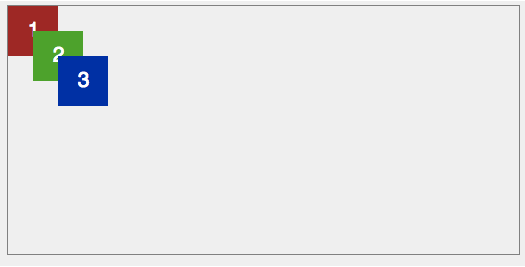
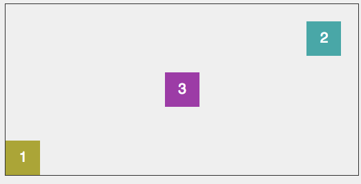

# Warmup - CSS - Relative + Absolute Positioning

## Exercise 1 - Relative Positioning

#### Setup

Fork the pen [Warmup - CSS Positioning - Relative](https://codepen.io/muktek-warmups/pen/zaQzjG?editors=1100) to your profile.

#### Instructions

- Edit the CSS to create the demo below in the codepen repo. Use relative positioning:

## Exercise 2 - Absolute Positioning

#### Setup

- Fork the pen [Warmup - CSS Positioning - Absolute](https://codepen.io/muktek-warmups/pen/yEWXEd?editors=1100) to your profile.

#### Instructions

- Edit the CSS to create the demo below in the codepen repo. Use absolute positioning:

